# Weather Advisor LLM Orchestration Review

Use this file to comment on the proposed assistant flow. The Mermaid graph shows the full path from a user question to the final answer. The notes below explain what each stage is responsible for and why it exists.

## Orchestration Graph

```mermaid
flowchart TD
  A["User asks Weather Advisor"] --> B["Frontend builds AssistantContext"]
  B --> B1["Selected region + layer values"]
  B --> B2["Map center + visible regions"]
  B --> B3["Active layer + timeline"]
  B --> B4["Forecast/provider status"]
  B --> B5["NWS alerts in context"]
  B --> B6["Conversation state"]

  B --> C["POST /api/chat"]

  C --> D["Start Gate: Semantic Planner"]
  D --> D1["Read raw user question"]
  D --> D2["Read dashboard data manifest"]
  D --> D3["Read current dashboard context"]
  D --> D4["Infer intent/activity"]
  D --> D5["Extract/correct locations"]
  D --> D6["Extract time window"]
  D --> D7["Identify requested dashboard layer or metric"]

  D --> E["Structured Interpretation"]
  E --> E1["intent"]
  E --> E2["activity"]
  E --> E3["locations / route endpoints"]
  E --> E4["time window"]
  E --> E5["requested layer"]
  E --> E6["required data"]
  E --> E7["missing external data"]
  E --> E8["confidence / ambiguity"]

  E --> F["Data Availability Gate"]
  F --> F1["Compare required data against manifest"]
  F --> F2["Check selected/map/visible-region context"]
  F --> F3["Check forecast fields"]
  F --> F4["Check dashboard layers"]
  F --> F5["Check alerts"]
  F --> F6["Mark unavailable data"]

  F --> G{"Can answer?"}

  G -->|No| H["Insufficient Data Response"]
  H --> H1["Explain what is missing"]
  H --> H2["Do not invent fallback facts"]

  G -->|Needs user context| I["Ask Follow-Up"]
  I --> I1["Ask only for missing slot"]
  I --> I2["Save planner state"]
  I --> I3["Wait for user response"]
  I3 --> C

  G -->|Partially| J["Partial Answer Path"]
  J --> J1["Answer weather/dashboard part"]
  J --> J2["Name missing external systems"]
  J --> J3["Keep claims bounded"]

  G -->|Yes| K["Execution Router"]

  K --> K1{"Question Type"}

  K1 -->|Single location| L["Single Location Pipeline"]
  L --> L1["Resolve/geocode location"]
  L --> L2["Fetch forecast"]
  L --> L3["Build weather evidence"]

  K1 -->|Selected/map area| M["Dashboard Area Pipeline"]
  M --> M1["Use selected region or nearest map center"]
  M --> M2["Read active layer + layer values"]
  M --> M3["Build dashboard explanation"]

  K1 -->|Visible region ranking| N["Layer/Weather Ranking Pipeline"]
  N --> N1["Use visible regions"]
  N --> N2["Rank by requested layer or weather metric"]
  N --> N3["Avoid proxy substitution unless explicitly labeled"]

  K1 -->|Route/travel| O["Route Pipeline"]
  O --> O1["Resolve origin"]
  O --> O2["Resolve destination"]
  O --> O3["Fetch endpoint/corridor forecast"]
  O --> O4["Build route-weather evidence"]
  O --> O5["Score hourly start windows when available"]

  K1 -->|Delivery/business impact| P["Business Impact Pipeline"]
  P --> P1["Check location"]
  P --> P2["Check expected time window"]
  P --> P3["Estimate weather-related risk only"]
  P --> P4["Exclude tracking/traffic/platform data"]

  K1 -->|Outdoor work/event/clothing/stargazing| Q["Application Pipeline"]
  Q --> Q1["Map application to required weather facts"]
  Q --> Q2["Build practical evidence"]
  Q --> Q3["Name missing external factors"]

  L --> R["Evidence Package"]
  M --> R
  N --> R
  O --> R
  P --> R
  Q --> R
  J --> R

  R --> R1["Verified facts"]
  R --> R2["Allowed claims"]
  R --> R3["Forbidden claims"]
  R --> R4["Missing data"]
  R --> R5["Suggested actions/map movement"]
  R --> R6["Conversation state"]

  R --> S{"Final LLM available?"}

  S -->|No| T["Deterministic Response Writer"]
  S -->|Yes| U["Humanized Final Answer Writer"]

  U --> U1["Warm, concise language"]
  U --> U2["Application-specific advice"]
  U --> U3["Uses only verified evidence"]
  U --> U4["No invented data"]
  U --> U5["No internal planner labels"]

  U --> V["Sanitizer"]
  T --> V

  V --> V1["Clamp verdict/confidence/actions"]
  V --> V2["Preserve guardrails"]
  V --> V3["Preserve conversation state"]
  V --> V4["Remove internal reasoning"]

  V --> W["Frontend renders response"]
  W --> W1["Answer"]
  W --> W2["Verdict"]
  W --> W3["Good windows / risks"]
  W --> W4["Map movement"]
  W --> W5["Updated memory"]
```

## Stage Details

### 1. User Asks Weather Advisor
This is the raw user message. It may be clean, messy, misspelled, incomplete, or a follow-up to a previous question.

Examples:
- "Weather in Rochester next week"
- "Will my food delivery be delayed?"
- "Which region has the highest fire risk?"
- "My house is in Birmiingham Alabama. Is it wise to do exterior repairs tomorrow?"

### 2. Frontend Builds AssistantContext
The frontend sends the backend compact dashboard state along with the message.

This includes:
- Selected region, if any
- Current map center and visible regions
- Active layer and timeline day
- Dashboard layer values, such as risk, fire, heat, wind, humidity, cloud, CDD
- Forecast and alert provider status
- NWS alerts visible in the current map context
- Conversation state from the prior assistant turn

Why it matters:
The assistant cannot know what the map is showing unless the frontend sends it.

### 3. Start Gate: Semantic Planner
This is the first LLM-style reasoning stage. It should not answer the user.

Its job is to understand the question and turn messy language into structured meaning.

It should identify:
- What the user is trying to do
- Whether the question is weather/dashboard related
- Any locations, including misspellings
- Time window
- Activity or application
- Requested dashboard layer or metric
- Whether the wording is ambiguous

Example input:
`Birmiingham ALabama exterior repairs tomorrow`

Example output:
`intent = outdoor_work`, `location = Birmingham, AL`, `timeWindow = tomorrow`

### 4. Structured Interpretation
This is the normalized version of the question.

It should contain fields like:
- `intent`
- `activity`
- `locations`
- `timeWindow`
- `requestedLayer`
- `requiredData`
- `missingExternalData`
- `confidence`

Why it matters:
The rest of the system should not depend on fragile regex guesses or raw text alone.

### 5. Data Availability Gate
This stage checks whether the dashboard can actually answer the interpreted question.

It compares required data against the dashboard manifest.

Available examples:
- Forecast temperature
- Apparent temperature / heat index
- Rain
- Wind
- Humidity
- Cloud cover
- NWS alerts
- Dashboard layer values

Unavailable examples:
- AQI
- River discharge
- Traffic
- Package tracking
- Restaurant prep status
- Live radar
- Light pollution
- Moon phase
- Smoke/haze

Why it matters:
This is the main anti-hallucination gate.

### 6. Can Answer Decision
The system decides one of four paths:

1. Fully answerable
2. Partially answerable
3. Needs a follow-up question
4. Not answerable from dashboard data

Examples:
- Fully answerable: "Weather in Houston tomorrow"
- Partially answerable: "Will Amazon be delayed?" because weather risk can be estimated, but tracking/traffic are missing
- Needs follow-up: "Will my delivery be delayed?" because location/time are missing
- Not answerable: "What is the AQI?" if AQI is not available

### 7. Execution Router
This routes the request to the right pipeline.

Major routes:
- Single location
- Selected or map area
- Visible region ranking
- Route/travel
- Delivery/business impact
- Outdoor work/event/clothing/stargazing

Why it matters:
Different user questions require different evidence. A travel route is not the same as a dashboard-layer explanation.

### 8. Single Location Pipeline
Used for city/location questions.

It:
- Resolves or geocodes the location
- Fetches forecast
- Builds weather evidence

Example:
"How is Rochester, NY for the next 4 days?"

### 9. Dashboard Area Pipeline
Used for questions about the current map or selected area.

It:
- Uses selected region if available
- Otherwise uses nearest visible map region
- Reads dashboard layer values
- Explains risk/layer drivers

Example:
"Explain this area's risk"

### 10. Layer/Weather Ranking Pipeline
Used when the user asks which region is highest, lowest, best, or worst for a metric.

It:
- Uses visible regions
- Ranks by requested dashboard layer or weather metric
- Avoids pretending one metric is another

Example:
"Which region has the highest fire risk?"

Important rule:
If fire layer data is unavailable, it should say so. It should not silently use wind as a substitute.

### 11. Route Pipeline
Used for travel between places.

It:
- Resolves origin
- Resolves destination
- Adds midpoint/corridor when useful
- Fetches forecasts
- Scores hourly start windows when available

Example:
"When should I leave Rochester for NYC tomorrow?"

Boundary:
It can answer weather-wise. It cannot know traffic, crashes, road closures, construction, or actual travel time.

### 12. Delivery / Business Impact Pipeline
Used for delivery and operational questions.

It:
- Checks location
- Checks expected time window
- Estimates weather-related disruption only
- Names missing external systems

Example:
"Will my food delivery be delayed around 4 PM in Birmingham?"

Boundary:
It cannot know restaurant prep, courier assignment, Amazon tracking, platform backlog, or traffic.

### 13. Application Pipeline
Used for practical use cases like:
- Outdoor repairs
- Field work
- Events
- Clothing
- Stargazing

It maps the activity to weather facts.

Examples:
- Exterior repair: rain, wind, heat, humidity, alerts
- Clothing: high/low temperature, rain, wind, humidity
- Stargazing: cloud cover, rain, wind, alerts

### 14. Evidence Package
This is the bundle sent to the final answer writer.

It should include:
- Verified facts only
- Allowed claims
- Forbidden claims
- Missing data
- Map movement actions
- Conversation state

Why it matters:
The final answer writer should not reason from scratch. It should explain verified evidence.

### 15. Final LLM Answer Writer
This turns the evidence package into a human-friendly answer.

It should:
- Be warm and concise
- Answer the user's actual application
- Use only verified facts
- Name important missing data
- Avoid internal labels like planner, ontology, manifest, or JSON

### 16. Deterministic Response Writer
Used when the final LLM is unavailable.

It writes a plain fallback response from rules and verified facts.

Why it matters:
The app still works if the OpenAI API is unavailable.

### 17. Sanitizer
This clamps and preserves safety.

It should:
- Keep only allowed verdicts/confidence values
- Preserve backend guardrails
- Preserve conversation state
- Prevent unsafe map actions
- Remove internal reasoning from UI

### 18. Frontend Renders Response
The UI displays:
- Answer
- Verdict
- Good windows or risks
- Map movement
- Updated memory for follow-up questions

## Key Design Principle

The assistant should be flexible with language but strict with facts.

That means:
- LLM can interpret messy wording
- Backend verifies against dashboard data
- Final answer only uses verified evidence
- Missing data is named clearly

