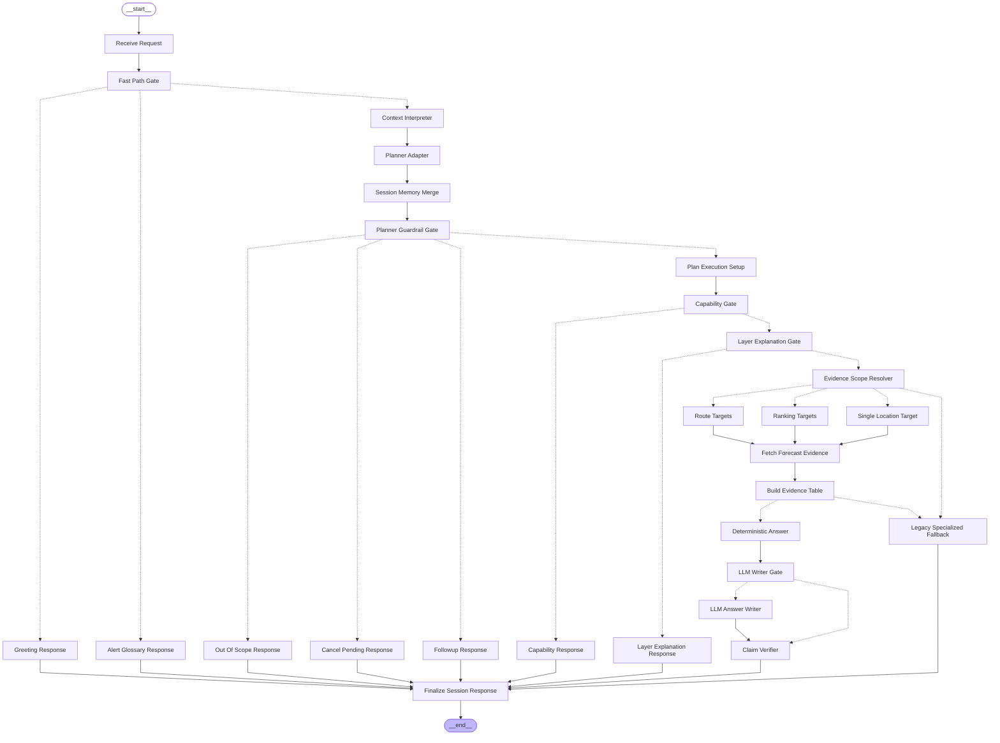

# SkyScout LangGraph Orchestration

This document is generated from `server/assistant/skyscoutGraph.mjs`.

SkyScout currently runs in `server/http.mjs` as a guarded assistant pipeline. The LangGraph below captures the intended orchestration shape: fast-path responses, structured interpretation, session-aware follow-up handling, evidence retrieval, deterministic fallback, optional LLM answer writing, claim verification, and final session response.



## Node Reference

| Node ID | Label | Purpose |
| --- | --- | --- |
| `receive_request` | Receive Request | Validate /api/chat input, start or resume the SkyScout session, and open a trace. |
| `fast_path_gate` | Fast Path Gate | Short-circuit simple greetings and alert-term explanations before invoking the planner. |
| `greeting_response` | Greeting Response | Return SkyScout's warm intro response and clear stale pending slots. |
| `alert_glossary_response` | Alert Glossary Response | Explain weather alert language from the local glossary when the user asks what an alert means. |
| `context_interpreter` | Context Interpreter | Use the OpenAI structured interpreter when available, with deterministic local fallback, to produce a ContextPacket. |
| `planner_adapter` | Planner Adapter | Convert and verify the ContextPacket into the older internal planner shape used by the current server route. |
| `session_memory_merge` | Session Memory Merge | Merge slot answers or refinements with the stored plan, then clear satisfied pending slots. |
| `planner_guardrail_gate` | Planner Guardrail Gate | Route out-of-domain, cancel, and missing-slot states before fetching weather evidence. |
| `out_of_scope_response` | Out Of Scope Response | Return a weather-dashboard scope response without pretending to answer unrelated questions. |
| `cancel_pending_response` | Cancel Pending Response | Clear pending SkyScout state when the user cancels or changes course. |
| `followup_response` | Followup Response | Ask one typed follow-up question using fixed templates for location, route endpoint, time, or search scope. |
| `plan_execution_setup` | Plan Execution Setup | Store the validated plan, derive the application lens, interpretation, and capability verdict. |
| `capability_gate` | Capability Gate | Block unsafe or unsupported answers and allow partial weather-only answers with explicit missing data. |
| `capability_response` | Capability Response | Return a guarded response for unsafe, out-of-domain, or unsupported-by-data requests. |
| `layer_explanation_gate` | Layer Explanation Gate | Answer dashboard-layer explanation questions directly from the active layer and map context. |
| `layer_explanation_response` | Layer Explanation Response | Explain the selected map layer without invoking forecast retrieval. |
| `evidence_scope_resolver` | Evidence Scope Resolver | Resolve whether evidence should be fetched for one location, a route, visible/ranked candidates, or a selected map point. |
| `route_targets` | Route Targets | Resolve origin, destination, and optional midpoint targets for route weather questions. |
| `ranking_targets` | Ranking Targets | Resolve visible, regional, statewide, or nationwide candidate locations for ranking questions. |
| `single_location_target` | Single Location Target | Resolve an explicit city, selected region, or map-center fallback for single-place advice. |
| `fetch_forecast_evidence` | Fetch Forecast Evidence | Fetch live forecast rows for resolved points through the provider layer and its fallbacks. |
| `build_evidence_table` | Build Evidence Table | Compute verified weather facts requested by the ContextPacket: heat, wind, rain, cloud, CDD, alerts, rankings, and windows. |
| `deterministic_answer` | Deterministic Answer | Render a safe deterministic answer from the evidence table. This is the fallback answer and verifier baseline. |
| `llm_writer_gate` | LLM Writer Gate | Use OpenAI only when a key exists and the answer is not a follow-up; otherwise keep deterministic output. |
| `llm_answer_writer` | LLM Answer Writer | Ask the final answer writer to humanize the response using only verified evidence and explicit boundaries. |
| `claim_verifier` | Claim Verifier | Block unsupported claims, ungrounded numbers, exact setpoints, ETA promises, traffic claims, and unsafe guarantees. |
| `legacy_specialized_fallback` | Legacy Specialized Fallback | Compatibility path for old route/ranking/single-location handlers when the evidence-table path cannot resolve enough data. |
| `finalize_session_response` | Finalize Session Response | Append the response to session memory, return conversationState, and close the trace. |

## How To Regenerate

```powershell
npm.cmd run graph:skyscout
```

The generated Mermaid file is also written to `docs/skyscout-langgraph.mmd`.
